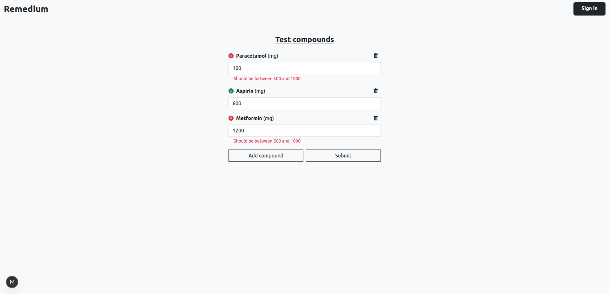
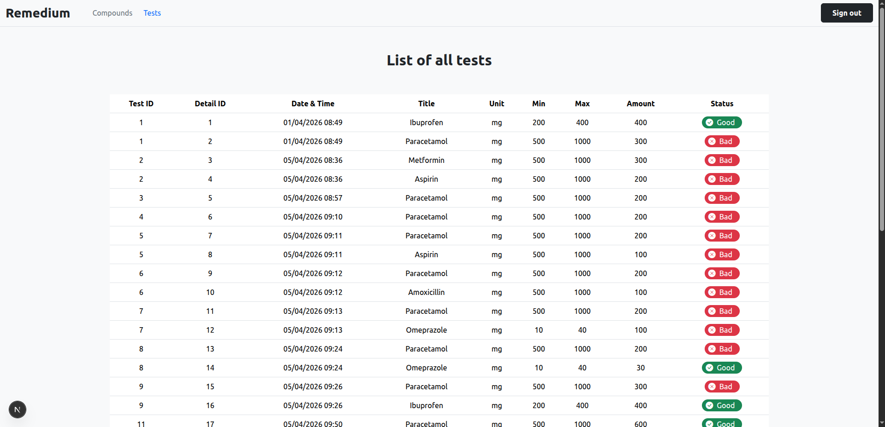
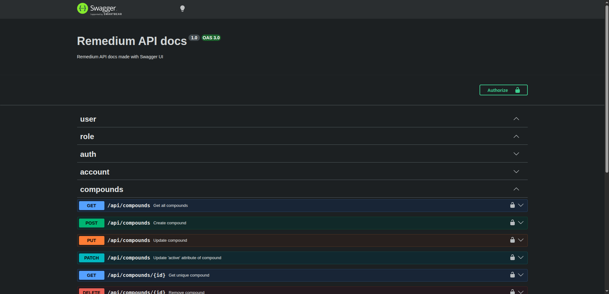

# Remedium

[](https://github.com/GimmyR/remedium/actions/workflows/ci.yaml)

Remedium is a web application that allows to test chemical compounds in order to create a medication.

It is built with:

- **Next.js** for the frontend  
- **Nestjs** for the API  
- **PostgreSQL** for data persistence  
- **Docker** for containerized deployment

## Live Demo
- Frontend: https://remedium-front.vercel.app/
- API Documentation: https://remedium-fmlc.onrender.com/api

> ℹ️ The backend is hosted on Render (free tier) and may experience a cold start.







## Prerequisites

Before building or running the application, make sure you have the following installed :

* **Docker** 29.0.2
* **Docker Compose** 2.40.3

## Environment variables

```bash
# For Database

DB_USERNAME=your_db_username
DB_PASSWORD=your_db_password
DB_name=your_database_name

# For NestJS

DATABASE_URL=postgres://your_db_username:your_db_password@db:5432/your_database_name
ADMIN_USERNAME=admin
ADMIN_PASSWORD=your_admin_password
PASSWORD_STRENGTH=12
JWT_SECRET=your_very_long_random_secret_key_here_at_least_64_bytes
```

If you want to use a `.env` file, place one in the project's root directory with "For Database" variables and one in *api/* folder with "For NestJS" variables.

## Launch the application

Open a terminal in the project's root directory and run the following command :

```bash
docker compose --profile prod up --build
```

You can access the frontend application in your browser at http://localhost:3000 .

The API documentation is available at http://localhost:8000/api .

## License

This project is licensed under the MIT License - see the [LICENSE](./LICENSE) file for details.
